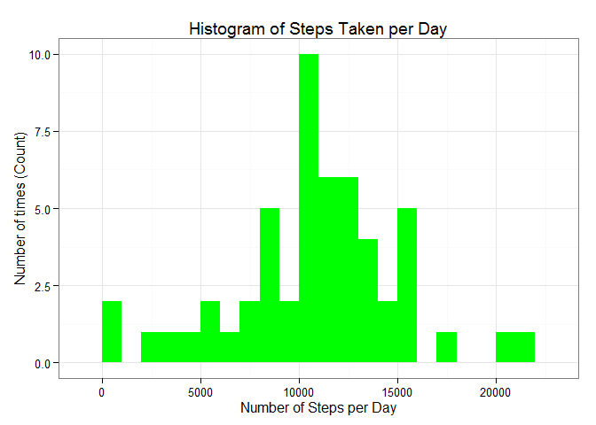

# Reproducible Research: Peer Assessment 1

##Set Global options - code chucks will always print.

opts_chunk$set(comment=NA, fig.width=6, fig.height=6 , echo=TRUE) 

## load libraries as 

```r
## get dplyr library
if (!"dplyr" %in% installed.packages()) install.packages(dplyr) 
require(dplyr)
```

```
## Loading required package: dplyr
## 
## Attaching package: 'dplyr'
## 
## The following object is masked from 'package:stats':
## 
##     filter
## 
## The following objects are masked from 'package:base':
## 
##     intersect, setdiff, setequal, union
```

```r
if (!"ggplot2" %in% installed.packages()) install.packages(ggplot2) 
require(ggplot2)
```

```
## Loading required package: ggplot2
```

```
## Warning: package 'ggplot2' was built under R version 3.1.3
```


## Loading and preprocessing the data


```r
setwd("~/GitHub/RepData_PeerAssessment1")
unzip("activity.zip")
activity <- read.csv("~/GitHub/RepData_PeerAssessment1/activity.csv",colClasses="character")
activity$date <- as.Date(activity$date, format="%Y-%m-%d")
activity$steps <-as.numeric(activity$steps)
activity$interval <-as.numeric(activity$interval)
act.df = tbl_df(activity)
```


## What is mean total number of steps taken per day?

The histogram below shows the total number of steps taken each day during the two month period with unkownn values removed from the data set. The mean and median total number of steps taken each day is shown. Again, unknown values are removed


```r
#load
spd <- summarise(select(group_by(act.df,date),steps),TotalSteps=sum(steps,na.rm=TRUE))
spd <- filter(spd,TotalSteps !=0)                 
#plot
ggplot(spd, aes(x = TotalSteps)) + 
  geom_histogram(fill = "green", binwidth = 1000) + 
  labs(title="Histogram of Steps Taken per Day", 
       x = "Number of Steps per Day", y = "Number of times (Count)") + 
  theme_bw() 
```

 

```r
#mean
spd.mean <- mean(spd$TotalSteps)
#median
spd.median <- median(spd$TotalSteps)
```

**mean is :** 10766,19

**median is :** 10765

## What is the average daily activity pattern?

The line graph below shows the average number of steps taken in each 5-minute interval over the two month period. The maximum average number of steps can be seen to have occured around 8:35 am. 


```r
spi <-summarise(select(group_by(act.df,interval),steps),meanSteps=mean(steps,na.rm=TRUE))


ggplot(data=spi, aes(x=interval, y=meanSteps)) +
  geom_line() +
  xlab("5-minute interval") +
  ylab("average number of steps taken") 
```

 

```r
intmax <- filter(spi , meanSteps==max(meanSteps))
interval.max <-intmax[,1]
```

The interval with the max mean step is 835

## Imputing missing values


```r
sumNA<-sum(is.na(activity$steps))
```

From the complete dataset of 17,568 observations a total of 2304  are missing.


In order to account for these missing values (NA's), they  have  been replaced with the interval averages. The histogram shows the total number of steps taken each day with this replacement and a new mean and median has been calculated for the total number of steps taken each day


```r
join <- left_join(act.df,spi)
```

```
## Joining by: "interval"
```

```r
NAreplaced<-mutate(join,Steps = (ifelse(is.na(steps), meanSteps, steps)))
sumstepsNA<-summarise(select(group_by(NAreplaced,date),Steps),totalSteps=sum(Steps,na.rm=TRUE))
plot(sumstepsNA$date,sumstepsNA$totalSteps,type="h",xlab="By date",ylab="Total steps")   
```

 

```r
nasum<-summarise(sumstepsNA,mean = mean(totalSteps),median=median(totalSteps))
```

New **mean :** 1.0766189\times 10^{4}

New **median :** 1.0766189\times 10^{4}

## Are there differences in activity patterns between weekdays and weekends?

The data in this section retains the replaced unknown values. The average steps per interval on a weekend day and a weekday day are shown in the line graphs below.


```r
NAreplaced.days<-mutate(NAreplaced,day=weekdays(date))
NAreplaced.newfactor<-mutate(NAreplaced.days,new=ifelse(day=="Saturday"|day=="Sunday","Weekend","Weekday"))
NAreplaced.newfactor$new<-as.factor(NAreplaced.newfactor$new)

sumsteps<-summarise(select(group_by(NAreplaced.newfactor,interval , new ,Steps),stepmean=mean(Steps,na.rm=TRUE)))


ggplot(sumsteps, aes(interval, stepmean)) + 
  geom_line() + 
  facet_grid(new ~ .) +
  xlab("5-minute interval") + 
  ylab("average number of steps")
```

 
